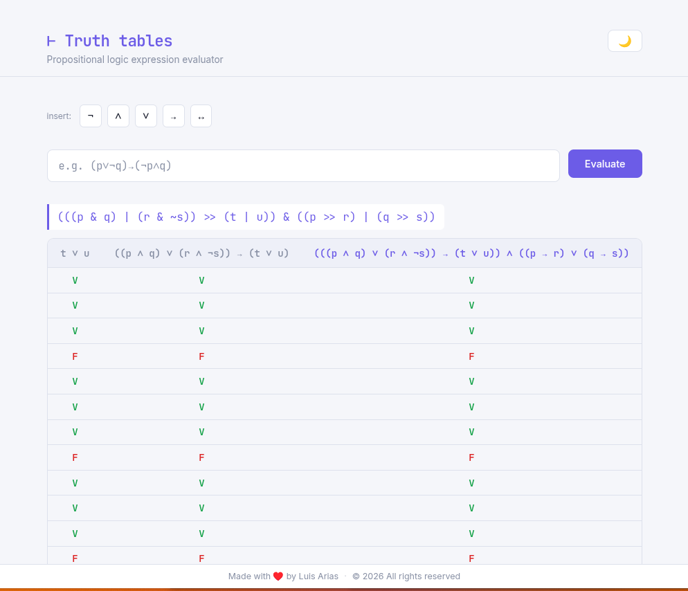
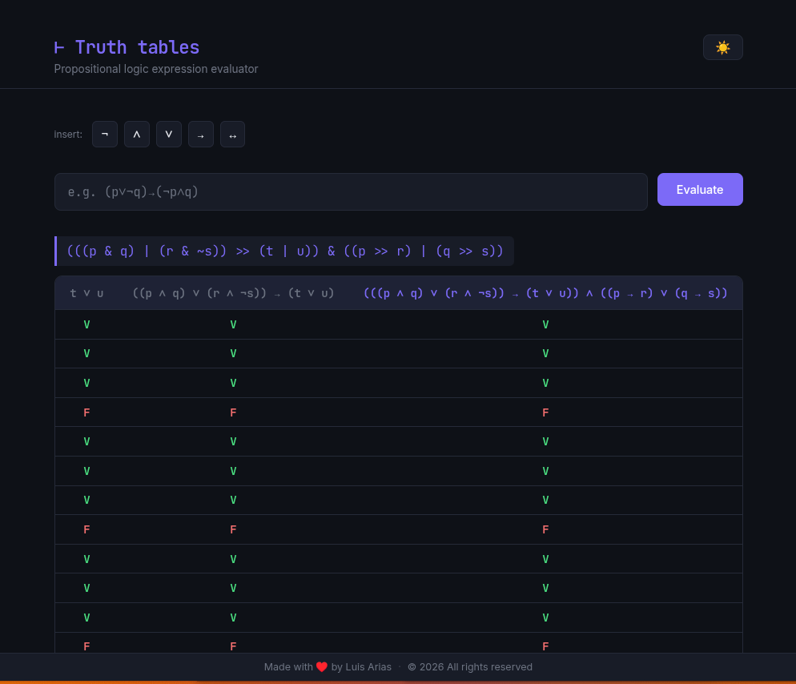

# Boolean Expression Truth Table Generator

A Python tool that generates truth tables from propositional logic expressions using **SymPy**. Available in two modes: a **command-line script** that exports to Markdown/CSV, and a **web interface** powered by Flask and React.

## Features

- Parse logical expressions using Unicode symbols (¬ ∧ ∨ → ↔) or ASCII equivalents
- Automatically detect variables and extract intermediate subexpressions
- Generate step-by-step evaluation columns
- Pretty-print expressions with correct precedence and parenthesization
- Export to Markdown or CSV
- Web interface with dark/light theme, symbol toolbar, and result history


<table>
  <tbody>
    <tr>
      <td></th>
      <td></td>
    </tr>
  </tbody>
</table>


## Project Structure

```
.
├── app.py                  # Flask web server
├── src/
│   └── truth_tables.py     # Standalone CLI script
└── web/                    # Frontend (React + Babel)
    ├── index.html
    └── src/
        ├── app.js
        └── components/
            ├── Header.js
            ├── SymbolBar.js
            ├── TruthTable.js
            └── Footer.js
```

## Requirements

- Python 3.10+
- SymPy
- Flask

## Installation

### 1. Create and activate a virtual environment

```bash
python -m venv .venv
```

**Linux / macOS:**
```bash
source .venv/bin/activate
```

**Windows:**
```bash
.venv\Scripts\activate
```

### 2. Install dependencies

```bash
pip install sympy flask
```

Or if you have a `requirements.txt`:

```bash
pip install -r requirements.txt
```

---

## Web Interface (Flask)

The web interface lets you type expressions, evaluate them interactively, and browse a scrollable history of results.

### Start the server

```bash
python app.py
```

Then open your browser at:

```
http://localhost:5000
```

### How it works

- `app.py` starts a Flask server that serves the React frontend from the `web/` folder
- The frontend is built with React 17 and transpiled in-browser by Babel — no build step required
- Typing an expression and clicking **Evaluate** (or pressing Enter) sends a `POST /evaluate` request to Flask
- Flask evaluates the expression with SymPy and returns the truth table as JSON
- Each result is added to the top of the page, building a scrollable history

### Supported input formats

| Symbol | ASCII alternative | Meaning          |
|--------|-------------------|------------------|
| `¬`    | `~`               | Logical NOT      |
| `∧`    | `&`               | Logical AND      |
| `∨`    | `\|`              | Logical OR       |
| `→`    | `->`              | Logical IMPLIES  |
| `↔`    | `<->`             | Biconditional    |

---

## CLI Script

The standalone script evaluates a list of expressions and writes results to a file — no browser required.

### Run

```bash
python src/truth_tables.py
```

### Configure expressions

Edit the `expressions` list inside `src/truth_tables.py`:

```python
expressions = [
    "¬(p → q)",
    "p ↔ q",
    "(p∨¬q)→(¬p∧q)",
    "((p & q) | (p & r)) >> t",
]
```

### Output format

Set `format` to `"md"` for Markdown or `"csv"` for CSV:

```python
evaluate(expressions, format="md")   # writes result.md
evaluate(expressions, format="csv")  # writes result.csv
```

Results are written to `./result.md` or `./result.csv` in the project root.

### Example output (Markdown)

```
# ¬(p → q)

| p | q | (p → q) | ¬(p → q) |
| --- | --- | --- | --- |
| V | V | V | F |
| V | F | F | V |
| F | V | V | F |
| F | F | V | F |

-----------------
```

---

## How It Works

1. The expression string is normalized — Unicode symbols are converted to SymPy-compatible operators
2. SymPy parses and builds an expression tree
3. The tree is traversed recursively to collect all intermediate `BooleanFunction` subexpressions
4. Each subexpression is evaluated for every possible truth assignment of the variables
5. Results are assembled into a table with variable columns, intermediate columns, and a final result column

---

## Author

**Luis Arias** | [@ariassd](https://github.com/ariassd)

## License

MIT License — open source and free to use.

---

© 2026 Luis Arias. All rights reserved.